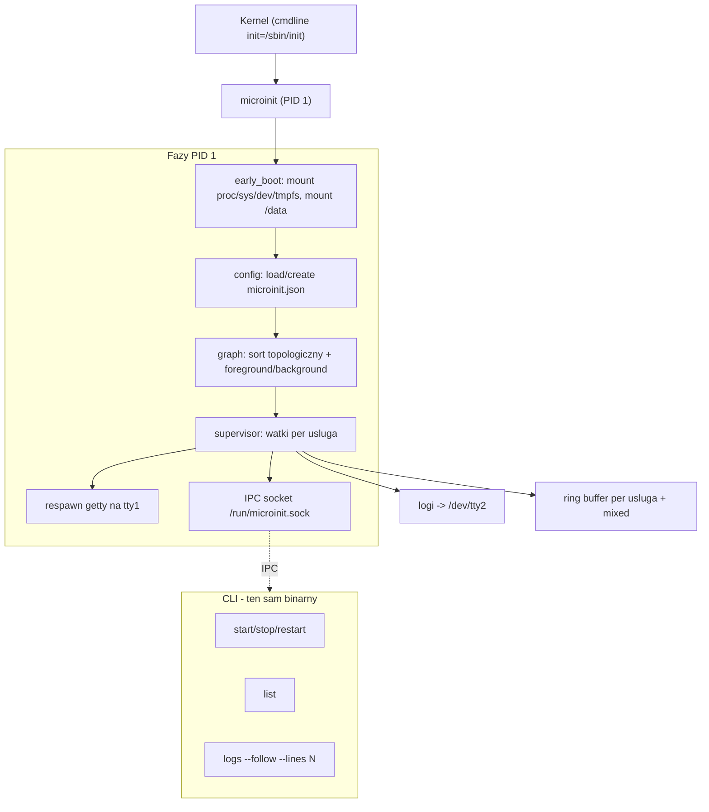
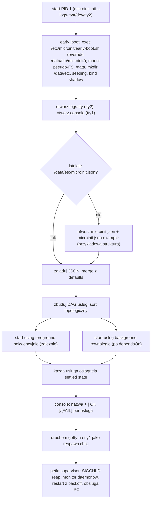
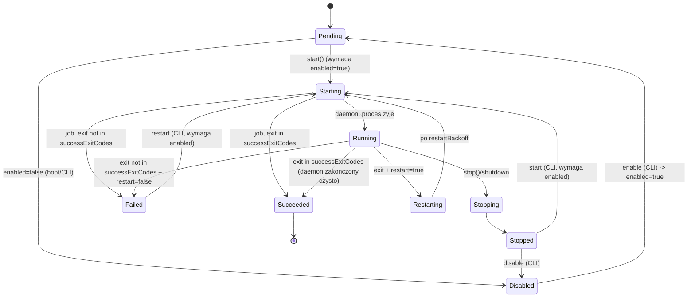
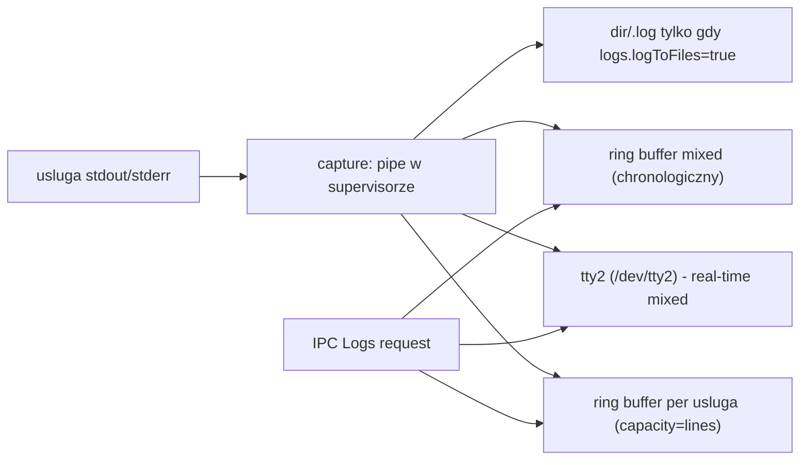

# microinit - architektura systemu init dla BigFred OS

## 1. Cel i zakres

`microinit` to nowy system init w Rust, ktory **zastepuje BusyBox init jako PID 1** oraz jednorazowy orchestrator `biginit`. Jeden binarny plik, wiele podkomend. Uslugi deklaratywne w `/data/etc/microinit.json`; kazda usluga moze miec wlasne komendy (`startCmd`/`stopCmd`/`restartCmd`) albo odwolywac sie do istniejacych skryptow SysV przez `cmd` (np. `cmd: "/etc/init.d/redis"` -> uruchamia `cmd start|stop|restart`). Migracja stopniowa.

**Obowiazki PID 1:** montowanie pseudo-FS i `/data`, ladowanie/tworzenie konfigu, start uslug, nadzor (supervisor), reapowanie zombie, obsluga sygnalow, console getty, sterowanie IPC przez socket uniksowy, uporzadkowany shutdown (stop w odwrotnej kolejnosci, umount, `reboot(2)`).

## 2. Architektura wysokiego poziomu



## 3. Struktura projektu (Cargo)

```
microinit/
  Cargo.toml          # workspace, single crate bin
  Makefile            # cross-compile aarch64-unknown-linux-musl, static
  src/
    main.rs           # dispatch CLI (clap): init | start | stop | restart | list | logs
    cli.rs            # handlery podkomend (klient IPC)
    init.rs           # procedura init PID 1: early_boot -> config -> graph -> supervisor -> getty -> shutdown
    early_boot.rs     # runner zewnetrzny skrypt early-boot.sh (override /data -> /etc), exec i czekanie na wynik
    config.rs         # model JSON, load/save/create+example, defaults, walidacja, merge override enabled
    service.rs        # Service struct, lifecycle, state machine, exec komend
    supervisor.rs     # watki per usluga, monitor exit, restart z backoff, zaleznosci
    graph.rs          # budowanie DAG, sort topologiczny, foreground/background
    ipc.rs            # server socket (init) + klient (cli), length-prefixed JSON frames
    protocol.rs       # typy komunikatow IPC (serde)
    logs.rs           # capture stdout/stderr uslug, ring buffer, tty2, mixed, streaming
    console.rs        # systemd-style [ OK ]/[FAIL] na tty1, kolory, wyrownanie
    shutdown.rs       # stop w odwrotnej kolejnosci, umount, reboot/poweroff/halt
    signals.rs        # signalfd/sigaction: SIGCHLD reap, SIGTERM/SIGINT, SIGUSR1/USR2
    error.rs          # thiserror typy bledow
```

### Zaleznosci (KISS, bez async runtime)

- `serde`, `serde_json` - konfig + IPC
- `clap` (derive) - CLI
- `nix` - mount, sigaction, waitpid, reboot, signalfd
- `thiserror` - bledy
- `libc` - niskopoziomowe
- `chrono` - timestampy logow
- std::thread + std::sync::mpsc + std::os::unix::net - watki, kanaly, socket

Brak tokio - watki + blokujacy socket sa prostsze i wystarczajace. Log streaming przez dedykowane watki obslugujace klientow socketu.

## 4. Boot sequence (procedura init)



### 4.1 early_boot - zewnetrzny skrypt sh (nie hardcodowany w Rust)

Logika wstepnego rozruchu (montaz pseudo-FS, `/data`, seeding, bind shadow) jest **skryptem sh**, nie hardcodowana w Rust - dla elastycznosci i unikniecia rekompilacji przy zmianach.

- Skrypt bazowy: `/etc/microinit/early-boot.sh` (w overlay rootfs, dostarczany z obrazem).
- Override (opcjonalny): `/data/etc/microinit/early-boot.sh` - jesli istnieje, microinit uzywa go zamiast bazowego (edycja bez przebudowy obrazu).
- `early_boot.rs` to **cienki runner**: wybiera sciezke (override > bazowa), exec `/bin/sh <skrypt>`, czeka na zakonczenie, interpretuje exit code (0=ok, !=0=blad na console + log; przy bledzie microinit nie kontynuuje bo `/data` moze byc niezamontowane).
- Skrypt odpowiada za (mirror obecnego `rcS` + `mount`):
  - `mount -t proc proc /proc`, `mount -t sysfs sysfs /sys`, `mount -t devtmpfs devtmpfs /dev` (lub `mdev -s`), `mount -t tmpfs tmpfs /tmp`, `/run`, `/var/log`, `/var/run`
  - `mount -o remount,rw /` lub utrzymanie RO; montaz `/data` po etykiecie `LABEL=bigfred-data`, fallback `mmcblk0p3`, fallback NVMe; `mkfs.ext4` jesli pusty
  - `mkdir -p /data/etc` rekursywnie (wymaganie: tworzenie katalogu i pliku konfigu przy starcie)
  - seeding konfigow z `/etc/bigfred/*`, `/etc/redis/*`
  - bind `/data/etc/shadow` -> `/etc/shadow`
- Skrypt jest wywolywany z przekazaniem `--logs-tty` i `--console` jako env vars (np. `MICROINIT_LOGS_TTY`, `MICROINIT_CONSOLE`), by mogl ew. przekierowac wlasny output.

### 4.2 Tworzenie konfigu przy pierwszym starcie

Jesli `/data/etc/microinit.json` nie istnieje: utworz katalog rekursywnie, zapisz domyslny `microinit.json` (minimalna struktura z `services: []` lub podstawowymi uslugami) oraz `microinit.json.example` z pelna przykladowa struktura pokazujaca oba wzorce (komendy wlasne + `cmd` do skryptu). Uprawnienia `0644`, katalog `0755`. Plik override `microinit.services.enabled-override.json` tworzy sie lazily (dopiero przy pierwszej zmianie `enable`/`disable`), nie przy pierwszym starcie.

## 5. Model uslugi (JSON)

```json
{
  "version": 1,
  "logs": { "tty": "/dev/tty2", "initTty": "/dev/tty3", "lines": 300, "dir": "/data/logs", "logToFiles": false },
  "socket": "/run/microinit.sock",
  "console": "/dev/tty1",
  "services": [
    {
      "name": "redis",
      "enabled": true,
      "daemon": true,
      "restart": true,
      "restartBackoff": 2,
      "successExitCodes": [0],
      "background": false,
      "dependsOn": ["network"],
      "cmd": "/etc/init.d/redis",
      "startCmd": null,
      "stopCmd": null,
      "restartCmd": null,
      "env": {},
      "cwd": "/"
    },
    {
      "name": "remote-icmp",
      "daemon": true,
      "restart": true,
      "restartBackoff": 5,
      "background": true,
      "dependsOn": ["network"],
      "startCmd": "/usr/bin/bigfred-remote-icmp --config /data/etc/loco-server.conf",
      "stopCmd": "killall bigfred-remote-icmp"
    }
  ]
}
```

### Reguly komend

- Jesli `startCmd`/`stopCmd`/`restartCmd` sa `null`, uzywany jest `cmd` z doklejona akcja: `cmd start`, `cmd stop`, `cmd restart` (kompatybilnosc ze skryptami SysV).
- Komendy sa shellowe (uruchamiane przez `/bin/sh -c "<cmd>"`), aby zachowac kompatybilnosc z obecnymi skryptami i skladnia shell.

### Pola uslugi

| Pole | Typ | Default | Opis |
|------|-----|--------|------|
| name | string | req | identyfikator |
| enabled | bool | true | czy usluga jest wlaczona (start w boot + mozliwosc recznego startu); nadpisywana przez override |
| daemon | bool | true | true=proces trwaly, false=job startowy (succeeded/failed) |
| restart | bool | false | restart po padnieciu (tylko daemon=true) |
| restartBackoff | int | 2 | sekundy miedzy restartami |
| successExitCodes | [int] | [0] | kody traktowane jako sukces |
| startWaitSecs | int | 0 | dla daemon=true: ile sekund czekac po starcie; proces musi przezyc okno (wyjscie = Failed). Przy 0: krotki grace SysV, exit w successExitCodes = Running |
| shutdownWaitSecs | int | 5 | po sygnale stop / stopCmd czekaj N s, potem SIGKILL |
| background | bool | false | true=start rownolegle, nie blokuje boot |
| dependsOn | [string] | [] | uslugi, ktore musza osiagnac settled przed startem |
| cmd | string? | null | bazowa komenda (fallback dla start/stop/restart) |
| startCmd/stopCmd/restartCmd | string? | null | konkretne komendy |
| env | object | {} | zmienne srodowiskowe |
| cwd | string | "/" | katalog roboczy |

### 5.1 Override flagi `enabled` (bez edycji main configu)

- Plik override: `/data/etc/microinit.services.enabled-override.json` - mapa `{ "<name>": true/false }`.
- Ladowany po main configu i **nadpisuje** `enabled` per usluga. Brak wpisu = wartosc z main configu (default true).
- Tworzony lazily (tylko gdy pierwsza zmiana); atomic write (tmp + rename); uprawnienia `0644`.
- Komendy `microinit enable {name}` / `microinit disable {name}` zapisuja odpowiednio `true`/`false` do override (CLI laczy sie z daemonem przez IPC, daemon aktualizuje override i stosuje zmiane na zywo: enable -> start uslugi jesli nie running, disable -> stop uslugi).
- Semantyka `enabled=false`: usluga nie startuje w boot, `microinit start {name}` odmawia (blad), restart nie ruszy. Nadal widoczna w `list` (stan Disabled).
- `microinit list` pokazuje kolumne `enabled` (wlaczona/wylaczona) obok stanu.

## 6. State machine uslugi



### Logika startu i monitoringu

- **daemon=true:** uruchom proces, czekaj `startWaitSecs` (przy 0: krotki grace SysV). Po oknie: proces zyje -> `Running`; przy `startWaitSecs=0` i exit w successExitCodes -> `Running` (SysV); inaczej wyjscie w oknie -> `Failed`. Dalej watek monitora czeka na `waitpid`. Jesli proces zakonczy sie pozniej: exit in `successExitCodes` -> `Succeeded` (nie restartuj). Jesli `restart=true` -> `Restarting` -> czekaj `restartBackoff` -> `Starting`. Jesli `restart=false` -> `Failed`.
- **daemon=false (job):** uruchom, czekaj na zakonczenie, klasyfikuj `Succeeded`/`Failed` po `successExitCodes`. Nie monitoruj dalej.
- **stop:** uruchom `stopCmd` (jesli jest), wyslij SIGTERM do tracked PID, czekaj `shutdownWaitSecs`, potem SIGKILL.
- **background=true:** startuje rownolegle, nie blokuje fazy boot; wypisuje status na console gdy osiagnie settled state (asynchronicznie).
- **background=false (foreground):** blokuje boot do settled state; console pokazuje status natychmiast po osiagnieciu settled.
- **dependsOn:** before start, if any dependency is not yet `Running`/`Succeeded`, enter `waiting_for_dependency` and retry until ready (or until manual `stop`/disable). Do not fail the start when a dependency is temporarily `Failed`.
- **enabled=false:** usluga w stanie `Disabled` - nie startuje w boot, `start`/`restart` przez CLI odmawiaja (blad). `enable` CLI przywraca `enabled=true` i (opcjonalnie) startuje usluge.

## 7. Sortowanie i kolejnosc boot

- Buduj DAG z `dependsOn`. Wykryj cykle -> blad na console + log.
- **Foreground** uslugi startuja w porzadku topologicznym, sekwencyjnie (kazda czeka na settled przed nastepna).
- **Background** uslugi startuja rownolegle w osobnych watkach, gdy ich `dependsOn` sa settled.
- To rozdziela szybkie uslugi (foreground: mount, network, sysctl) od dlugich demonow (background: grafana, bigfred).

## 8. IPC - socket uniksowy

- Socket: `/run/microinit.sock` (tmpfs `/run`), uprawnienia `0600`, wlasciciel root.
- Framing: **4-bajtowy LE length prefix + JSON payload** (robust do streamingu, nie zalezy od newline).
- Server: dedykowany watek w init, akceptuje klientow, kazdy klient obslugiwany w osobnym watku.
- Autoryzacja: peercred (SO_PEERCRED) - tylko uid 0 lub uprawnieni; opcjonalnie token w `/run/microinit.token`.

### Komunikaty (protocol.rs)

| Request | Pola | Response |
|---------|------|----------|
| List | - | `[{name, state, pid, restarts, enabled}]` |
| Start | name | Ok/Error |
| Stop | name | Ok/Error |
| Restart | name | Ok/Error |
| Status | name | `ServiceStatus` |
| Enable | name, enabled: bool | Ok/Error (zapisuje override, stosuje zmiane na zywo) |
| Logs | name?, follow, lines | strumien `LogLine{ts, service, level, msg}` |
| Shutdown | mode: reboot/poweroff/halt | Ok |

- `Logs` bez `name` = strumien mieszany (jak tty2). `follow=true` utrzymuje polaczenie i streamuje nowe linie.
- `microinit init` (daemon) obsluguje streamowanie logow przez ten sam socket - ujednolicenie z `microinit logs`.

## 9. Architektura logow



- Kazda usluga ma stdout/stderr przechwytywane przez pipe w watku supervisora.
- Watek czyta linie, opakowuje w `LogLine{ts, service, level, msg}` i rozsyla do:
  - **tty2** / **tty3** (real-time; init na initTty)
  - **ring buffer per usluga** (capacity = `logs.lines`, default 300) — zawsze w RAM
  - **ring buffer mixed** (capacity = `logs.lines`)
  - **plik** `logs.dir/<name>.log` tylko gdy `logs.logToFiles=true` (default **false**; `logs.dir` domyslnie `/data/logs`)
- `microinit logs <name>` czyta ring buffer uslugi; `--follow` dolacza do streamu na zywo.
- `microinit logs` (bez name) czyta ring buffer mixed; `--follow` streamuje mieszany.
- `--lines N` (cli) nadpisuje ile ostatnich linii pokazac; default z JSON (`logs.lines`, domyslnie 300).
- Wlasne logi microinit (internal) trafiaja na init-logs-tty z service="microinit".

## 10. Console - styl systemd (tty1)

- Format wyrownany: `   <nazwa uslugi>........... [ OK ]` / `[FAIL]` z kolorami (zielony OK, czerwony FAIL).
- `console.rs`: buforuje linie, drukuje `Starting <name>...` przy starcie, nadpisuje/uzupelnia status po settled.
- Po zakonczeniu init uruchamia **getty** na tty1 jako respawn child (klasyczna petla respawn PID 1).
- Jesli usluga foreground fail -> `[FAIL]` ale boot kontynuuje (jak biginit). Opcja `critical: true` (przyszlosc) moglaby zatrzymac boot.

## 11. Shutdown (PID 1)

- Wyzwalacze: `SIGTERM`/`SIGINT` (reboot), `SIGUSR1` (halt), `SIGUSR2` (poweroff), lub IPC `Shutdown{mode}`.
- Procedura (`shutdown.rs`):
  1. Stop wszystkich uslug w **odwrotnej kolejnosci topologicznej** (najpierw zalezne).
  2. Dla kazdej: uruchom `stopCmd` (lub `cmd stop`); timeout (np. 10s); jesli nie zakonczone -> `SIGTERM` -> `SIGKILL`.
  3. Poczekaj na zakonczenie wszystkich watkow supervisora.
  4. `umount /data`, `umount /` (remount,ro), `sync`.
  5. `reboot(RB_AUTOBOOT)` / `reboot(RB_POWER_OFF)` / `reboot(RB_HALT_SYSTEM)`.
- Reaping zombie (`SIGCHLD`): w petli `waitpid(-1, WNOHANG)` aby nie zostawiac defunct.

## 12. CLI - podkomendy (ten sam binarny)

Wszystkie komendy zarzadzajace lacza sie z daemonem przez `/run/microinit.sock` (klient IPC w `cli.rs`/`ipc.rs`).

| Komenda | Argumenty | Opis |
|---------|-----------|------|
| `init` | `--logs-tty=/dev/tty2` | procedura init PID 1 (jedyna uruchamiana przez kernel) |
| `start` | `<name>` | start uslugi przez IPC (tylko jesli enabled) |
| `stop` | `<name>` | stop uslugi przez IPC |
| `restart` | `<name>` | restart uslugi przez IPC |
| `enable` | `<name>` | wlacz usluge (zapis `true` do override, start na zywo) |
| `disable` | `<name>` | wylacz usluge (zapis `false` do override, stop na zywo) |
| `list` | - | status wszystkich uslug (stan, PID, restarty, enabled) |
| `logs` | `[name] [--follow] [--lines N]` | logi uslugi lub mieszane; N default 300 (z JSON/cli) |

- `logs --follow` utrzymuje strumien z socketu do Ctrl-C.
- `logs` bez name -> strumien mieszany (mirror tty2).
- Bledy IPC (daemon niezyje/socket brak) -> jasny komunikat + exit code != 0.

## 14. Dobre praktyki / zasady

- **DRY:** wspolny kod exec komend (`service.rs::run_command`), wspolny framing IPC (`ipc.rs`), wspolny ring buffer (`logs.rs::RingBuffer`).
- **KISS:** watki + kanaly zamiast async; JSON zamiast zlozonego formatu; brak zewnetrznych demonow.
- **Clean code:** jeden modul = jedna odpowiedzialnosc; `error.rs` z typami bledow; brak `unwrap` w sciezce PID 1 (graceful degradation).
- **Niezawodnosc:** restart z backoff, reapowanie zombie, idempotentny stop, timeouty na komendach, walidacja konfigu przy ladowaniu, atomic write konfigu (tmp + rename).
- **Bezpieczenstwo:** socket `0600`, peercred autoryzacja, drop uprawnien tam gdzie mozna (nie dla root-only uslug).
- **Unix conventions:** sygnaly zgodne z konwencja PID 1, `/run` tmpfs na socket, `/data/etc` na RW partycji, logi z timestampami.

## 15. Dokumentacja - strony man (format uniksowy)

Dokumentacja w klasycznych stronach man (groff/mandoc), instalowana do `/usr/share/man/manN/`. Format: **mdoc(7)** (czytelniejszy niz man(7), dziala z groff i mandoc - mandoc lzejszy dla embedded). Budowane z `make man` (groff/nroff) i walidowane w CI.

### 15.1 Strony man

| Strona | Sekcja | Tytul | Zawartosc |
|--------|--------|-------|-----------|
| `microinit` | 8 | microinit - system init i supervisor uslug | opis, fazy PID 1, boot sequence, sygnaly, shutdown, pliki powiazane, przyklady, zobacz tez |
| `microinit.json` | 5 | microinit.json - konfiguracja uslug | format JSON, pola sekcji `logs`/`socket`/`console`, pola uslugi (tabela), reguly komend (`cmd` fallback), przyklad, pliki override |
| `microinit.services.enabled-override.json` | 5 | override flagi enabled | format mapa `{name: bool}`, semantyka nadpisania, tworzenie lazy, interakcja z `enable`/`disable`, przyklad |
| `early-boot.sh` | 8 | early-boot.sh - skrypt wstepnego rozruchu | cel, lokalizacja (bazowa + override), env vars (`MICROINIT_LOGS_TTY`, `MICROINIT_CONSOLE`), obowiazki (mount, /data, seeding, shadow), exit codes, przyklad |

### 15.2 Struktura katalogow

```
microinit/
  man/
    man8/microinit.8.mdoc      # glowna strona (init + podkomendy start/stop/restart/enable/disable/list/logs)
    man5/microinit.json.5.mdoc
    man5/microinit.services.enabled-override.json.5.mdoc
    man8/early-boot.sh.8.mdoc
```

### 15.3 Zawartosc `microinit(8)` (szkielet mdoc)

```mdoc
.Dd August 3, 2026
.Dt MICROINIT 8
.Os "BigFred OS"
.Sh NAME
.Nm microinit
.Nd system init i supervisor uslug dla BigFred OS
.Sh SYNOPSIS
.Nm microinit
.Cm init
.Op Fl -logs-tty Ns = Ns Ar /dev/tty2
.Nm microinit
.Cm start|stop|restart|enable|disable
.Ar name
.Nm microinit
.Cm list
.Nm microinit
.Cm logs
.Op Ar name
.Op Fl -follow
.Op Fl -lines Ns = Ns Ar N
.Sh DESCRIPTION
.Op ... fazy PID 1, boot sequence, supervisor ...
.Sh SIGNALS
SIGTERM/SIGINT (reboot), SIGUSR1 (halt), SIGUSR2 (poweroff), SIGCHLD (reap).
.Sh FILES
.Pa /data/etc/microinit.json , /data/etc/microinit.services.enabled-override.json ,
.Pa /etc/microinit/early-boot.sh , /data/etc/microinit/early-boot.sh ,
.Pa /run/microinit.sock
.Sh EXAMPLES
.Op ... przyklady komend ...
.Sh SEE ALSO
.Xr microinit.json 5 ,
.Xr microinit.services.enabled-override.json 5 ,
.Xr early-boot.sh 8
```

### 15.4 Build i instalacja

- `Makefile`: cel `man` -> `mandoc -Thtml`/`groff -man` do HTML/PDF (opcjonalnie do docs/) + `gzip` do `.gz` (konwencja: man pages skompresowane).
- Buildroot package `os/package/microinit/`: instalacja `*.gz` do `/usr/share/man/man8/` i `man5/` (zgodnie z FHS).
- Walidacja w CI: `mandoc -Tlint` (sprawdza skladnie mdoc) + `man -l` (renderowanie bez bledow).
- `microinit --help` (clap) generuje krotkie streszczenie; pelna dokumentacja w man (DRY: opcje CLI opisane raz w man, clap czerpie z tych samych opisow).
