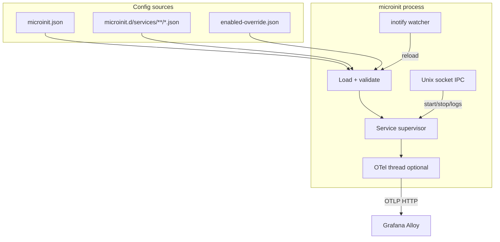

# microinit architecture

This document explains **why** microinit exists, **how** it is designed, and **which decisions** shape the implementation. It is written for readers who do not yet know the project.

---

## What microinit is in one sentence

**microinit** is a small program that on a device (or in a container) **starts and supervises services** — networking, databases, applications — according to a list stored in JSON files. It can also act as a classic system init (Linux process number 1).

It is not a full systemd. It aims to be **lightweight, predictable, and easy to embed** in a system image (for example BigFred OS) and in containers.

---

## Two modes: `init` and `supervise`

The same supervisor logic runs under two thin wrappers:

| | `microinit init` | `microinit supervise` |
|---|---|---|
| Typical use | Embedded / hub system (PID 1) | Container, distroless |
| Early-boot (mounts, etc.) | Yes | No |
| Console login (getty) | Yes, when PID 1 | No |
| Logs on TTYs (tty2 / tty3) | Yes | No (in-memory ring + IPC / optional files) |
| Service supervision + control socket | Yes | Yes |

**Architectural rule:** there are not two separate implementations. Both modes call the same startup path with different switches (`InitOpts`). A fix in the supervisor therefore applies on the device and in the container.

In a container the process is often **also PID 1**, so “I am PID 1 → start getty” would be wrong. Getty starts only when the mode is full `init` **and** the process is PID 1.

---

## Where configuration comes from

### Data directory: `DATA_DIR`

By default durable state lives under `/data`. Override with the **`DATA_DIR`** environment variable (absolute path only).

Typical files:

- `$DATA_DIR/etc/microinit.json` — main service list  
- `$DATA_DIR/etc/microinit.services.enabled-override.json` — which services are enabled/disabled (after `enable` / `disable`)  
- `$DATA_DIR/etc/microinit.d/services/**/*.json` — **drop-ins** (extra or overriding services)

### How the final config is assembled

1. Load `microinit.json`  
2. Merge all drop-ins (lexicographic path order; **later file wins** for the same service name)  
3. Apply the enable/disable override  
4. Validate (including `dependsOn` edges)

**Why drop-ins?** So the system image can ship a base service list while a specific device or product adds its own JSON without editing the main file.

### Hot-reload without restart

Changing JSON files on disk **does not require restarting** microinit. Linux notifies via **inotify** (native filesystem events — **no polling the disk every N seconds**).

After a burst of events (a save often produces several), a short **debounce (~300 ms)** runs, then config is reloaded. If the new JSON is invalid, the **previous** config is kept and a warning is logged.

On a successful reload the supervisor **diffs services**:

- new → start (honouring dependencies),  
- removed → stop,  
- definition change → restart,  
- enable / disable → start / stop.

Some settings **do not hot-reload** (process restart required): socket path, TTY settings, and file-logging options. That avoids moving the IPC listener or rebuilding the log hub mid-flight.

---

## How services run

Each service has, among other fields:

- name, start/stop commands (or a base `cmd`),  
- whether it is a daemon (long-lived) or a one-shot job,  
- whether to restart on crash,  
- dependencies (`dependsOn`),  
- wait times on start and on shutdown.

**Dependencies:** when start is requested (boot or CLI) and a `dependsOn` service is not yet `Running`/`Succeeded`, the dependent enters **`waiting_for_dependency`** and stays there until every dependency is ready, then starts automatically. A manual `stop` (or disable) cancels that wait — satisfying the dependency later does **not** restart a stopped service.

**Execution model:** one **monitor thread per service**. A shared main loop handles signals, zombie reaping, and socket commands. Child processes are collected by a central **reaper** (so multiple places do not race on `waitpid`).

External control (CLI, UI) goes through a **Unix socket** (default `$DATA_DIR/run/microinit.sock`, hub `/data/run/microinit.sock`): start, stop, restart, enable/disable, list, logs. The CLI `--socket` flag sets the same path for both the daemon and clients. Parent directories for the socket are created automatically.

---

## Logging

On a full system:

- **tty2** — service stdout/stderr,  
- **tty3** — microinit’s own messages (start/stop, errors, reload),  
- optionally files under `$DATA_DIR/logs` when `logToFiles` is enabled.

In `supervise` mode TTYs are not attached — logs stay in an in-memory ring and are available over IPC (`microinit logs`).

---

## Early-boot

Before loading JSON, `init` mode may run an **early-boot** script: mount `/proc`, `/sys`, run `fsck -y` on real block filesystems, apply fstab, prepare `/data`, and so on.

Script search order:

1. `$DATA_DIR/etc/microinit/early-boot.sh`  
2. `/etc/microinit/early-boot.sh`  
3. script embedded in the binary  

Mount policy therefore lives in a script / distro overlay, not hard-coded in Rust.

**Configuration is always loaded (or re-loaded) from disk only after early-boot returns**, so seeding of `$DATA_DIR/etc/microinit.json` and drop-ins by the script is visible to the supervisor. microinit does not create the config file before the script runs (that would race with mounting `/data`).

---

## Late unmount (shutdown)

At the end of ordered shutdown — after all supervised services have been stopped, and before `reboot(2)` / power-off / halt — `init` mode runs an **unmount** script (same search order as early-boot):

1. `$DATA_DIR/etc/microinit/unmount.sh`  
2. `/etc/microinit/unmount.sh`  
3. script embedded in the binary  

Failures are logged and **do not block** reboot (a stuck umount must not hang the board forever). Distro overlays typically reverse early-boot (unbind `/etc/shadow`, umount `/data`, `sync`).

---

## Android / supervise-only build

Cargo feature `init` (default) gates PID-1-only code: early-boot, getty, TTY attach,
late unmount, and `reboot(2)`. Android NDK builds use `--no-default-features`, so
only `microinit supervise` (plus CLI/IPC) is available.

Constraints for a normal Google Play app sandbox:

- Ship the binary inside the app and run it from a **Foreground Service** (persistent
  notification) — a hidden background daemon violates Play policy.
- Bind the control socket under **app-private storage** (e.g. `getFilesDir()`), never
  `/run/…`. Pass `--socket` / JSON `socket` accordingly. Same-UID clients only
  (`SO_PEERCRED` + `0600`).
- Service shell is `/system/bin/sh` with an Android `PATH`.
- Ordered shutdown **stops services, syncs, and exits** — no `reboot(2)` and no
  BusyBox `/sbin/*` fallback.
- Cross-app IPC over AF_UNIX is blocked by SELinux; same-app only.

---

## Metrics (OpenTelemetry → Grafana Alloy)

Observability is **optional on two levels**:

1. **Compile time:** the `otel` feature is in **default** — a normal `cargo build` includes the OTLP exporter. Build without OTel via `--no-default-features` (smaller PID 1 binary when needed).  
2. **Runtime:** JSON `openTelemetry.enable` — the metrics thread starts only when enabled.

The metrics thread:

- **does not block** the supervisor loop,  
- sleeps **10 s** after start, then tries to push to the OTLP endpoint (default Alloy on port **4318** HTTP),  
- retries every **30 s** on failure,  
- exports service restarts, livenessProbe failures, uptime, host CPU/RAM, and per-service CPU/RAM.

**Model:** microinit **pushes** metrics (OTLP client). It does not expose a scrapeable Prometheus HTTP endpoint. Grafana Alloy receives OTLP and can forward to Prometheus / Mimir / Grafana Cloud.

Example Alloy config and a dashboard live under `grafana/`.

With `panic = abort` in release, metrics code must avoid panics — a failure in the OTel thread must not take down PID 1.

---

## Binary and image distribution

Two independent Linux artifacts, plus an Android binary bundle:

1. **ORAS (linux)** — static arm64 binaries (`microinit` + `shutdown`) plus early-boot and unmount scripts for the hub system image, e.g. `ghcr.io/dcc-bigfred/microinit-linux-arm64`.
2. **ORAS (android)** — supervise-only Bionic binaries (`microinit` + `shutdown`, built
   with `--no-default-features`), e.g. `ghcr.io/dcc-bigfred/microinit-android-arm64`.
   GitHub Releases also ship `armv7` and `x86_64`.
3. **Distroless container image** (amd64 + arm64) — `ghcr.io/dcc-bigfred/microinit`, default `ENTRYPOINT /microinit` + `CMD supervise`.

Tag lifecycle: `main` / `sha-<7>` on push, `v*` / `latest-release` on release.

---

## Concept diagram

---

## Rules we keep when changing the code

1. **One supervisor path** — new modes are flags, not copy-pasted boot loops.  
2. **Declarative JSON config** — system behaviour should be readable from disk.  
3. **Safe reload** — a bad file must not tear down the running service set.  
4. **OTel on by default in the build** — disable only with `--no-default-features`; runtime still needs `openTelemetry.enable`.  
5. **Linux-first** — inotify, `/proc`, musl/static, nix; not aiming for full cross-platform support.  
6. **Socket as the only control channel** — CLI and UI speak the same protocol.  
7. **Separated log roles** — init operations vs service output; no forced TTYs in containers.

---

## Where to look next

- `README.md` — quick start, build, OTel  
- `man/man8/microinit.8.mdoc`, `man/man5/microinit.json.5.mdoc` — CLI and JSON field details  
- `grafana/alloy/microinit.alloy` — Alloy example  
- `examples/local-test/` — local run without a full system image  
