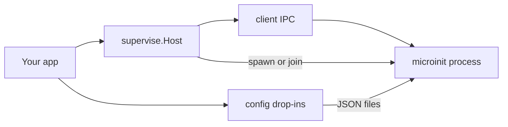

# Go SDK

Embed or control [microinit](https://github.com/dcc-bigfred/microinit) from Go.

## Module

```
github.com/dcc-bigfred/microinit/go
```

Tag releases as `go/vX.Y.Z` (required because the module path ends with `/go`).

```bash
go get github.com/dcc-bigfred/microinit/go@go/v0.3.0
```

Private repos: `GOPRIVATE=github.com/dcc-bigfred/*`.

Local monorepo:

```go
replace github.com/dcc-bigfred/microinit/go => ../microinit/go
```

## Packages

| Package | Import path | Role |
|---------|-------------|------|
| **client** | `…/go/client` | IPC to a running daemon |
| **config** | `…/go/config` | `ServiceDef`, drop-in read/write, labels helpers |
| **supervise** | `…/go/supervise` | Join or spawn `microinit supervise` inside your process |

Default control socket: `/data/run/microinit.sock` (`client.DefaultSocket`).

## Labels

Service configs may include `labels` (`map[string]string`). Convention for embedders:

```go
svc := config.WithCreatedBy(config.ServiceDef{
	Name: "worker", StartCmd: "exec /usr/bin/worker",
	OrderPriority: config.IntPtr(100), // optional; omitted → daemon default 100
}, "my-app")
// writes labels: {"created-by":"my-app"}
// OrderPriority: among ready services, lower starts earlier (nil omits the field;
// microinit then applies default 100). Pointer to 0 is serialized as 0.

// Filter a List() result:
for _, s := range list {
	if config.MatchLabels(s.Labels, map[string]string{config.LabelCreatedBy: "my-app"}) {
		fmt.Println(s.Name)
	}
}
```

CLI: `microinit list -l created-by=my-app` and `microinit list --show-labels`.

## Design: process vs product policy

`supervise.Host` only manages the **daemon process**:

- join an existing socket, or spawn one supervise instance
- `Shutdown` only if **this** Host spawned the process

Stopping services, tracking “owned” drop-ins, refusing system service names, Redis/Alloy templates — that stays in the application (e.g. bigfred).



## Example: IPC only (admin UI)

```go
package main

import (
	"fmt"
	"log"

	"github.com/dcc-bigfred/microinit/go/client"
)

func main() {
	c := &client.Client{Socket: client.DefaultSocket}
	list, err := c.List()
	if err != nil {
		log.Fatal(err)
	}
	for _, s := range list {
		fmt.Printf("%s %s\n", s.Name, s.State)
	}
	if info, err := c.Info(); err == nil {
		fmt.Printf("microinit %s build %s\n", info.Version, info.BuildCommit)
	}
	if err := c.Control("redis", "restart"); err != nil {
		log.Fatal(err)
	}
}
```

## Example: embed microinit in your process

```go
package main

import (
	"context"
	"log"
	"os"
	"os/signal"

	"github.com/dcc-bigfred/microinit/go/config"
	"github.com/dcc-bigfred/microinit/go/supervise"
)

func main() {
	ctx, stop := signal.NotifyContext(context.Background(), os.Interrupt)
	defer stop()

	data := "/data" // or your DATA_DIR
	h := supervise.New(
		data+"/run/microinit.sock",
		"microinit",
		data+"/etc/microinit.json",
		data+"/etc/microinit.d/services",
	)

	joined, err := h.EnsureRunning(ctx)
	if err != nil {
		log.Fatal(err)
	}
	log.Printf("microinit ready (joined=%v)", joined)

	// Application policy: write only your drop-ins.
	_ = config.WriteDropin(h.DropinDir, "app", "worker", config.WithCreatedBy(config.ServiceDef{
		Name:     "worker",
		Enabled:  config.BoolPtr(true),
		Daemon:   config.BoolPtr(true),
		RestartPolicy: config.RestartOnError,
		StartCmd: "exec /usr/bin/my-worker",
	}, "my-app"))

	<-ctx.Done()

	// Application policy: stop services you started (optional).
	_ = h.Client().Control("worker", "stop")

	// SDK: tear down the process only if we spawned it.
	if err := h.Shutdown(context.Background()); err != nil {
		log.Fatal(err)
	}
}
```

## Example: respect system services from base config

```go
system, err := config.BaseConfigServiceNames("/data/etc/microinit.json")
if err != nil {
	log.Fatal(err)
}
if _, ok := system["redis"]; ok {
	log.Fatal("refusing to overwrite system service redis")
}
err = config.WriteDropin(dropinDir, "infra", "redis", svc)
```

## client API (summary)

| Method | Description |
|--------|-------------|
| `List()` | All services |
| `Status(name)` | One service |
| `Control(name, start\|stop\|restart)` | Lifecycle |
| `Shutdown()` | Halt-mode shutdown (IPC); alias of `ShutdownMode("halt")` |
| `ShutdownMode(mode)` | Shutdown with `reboot` \| `poweroff` \| `halt` |
| `FollowLogs` / `ReadResponse` | Log stream |
| `ValidateName` / `FormatLogLine` | Helpers |

## config API (summary)

| Function | Description |
|----------|-------------|
| `WriteDropin` / `RemoveDropin` | Single file under `{dir}/{group}/{name}.json` |
| `SyncGroup` / `ListGroup` | Reconcile a group directory |
| `DropinExists` | Presence check |
| `BaseConfigServiceNames` | Names from main `microinit.json` |
| `WithCreatedBy` / `MatchLabels` | Label helpers (`created-by`) |
| `BoolPtr` / `IntPtr` | Optional JSON helpers |

## supervise API (summary)

| Method | Description |
|--------|-------------|
| `New(socket, bin, configPath, dropinDir)` | Construct host |
| `EnsureRunning(ctx) (joined, err)` | Join or spawn + wait for IPC |
| `Client()` | Bound IPC client |
| `Spawned()` | Whether this host owns the process |
| `Shutdown(ctx)` | Stop process **only if spawned** |

Also see [module README](../../go/README.md) and [Control socket API](../api.md).
