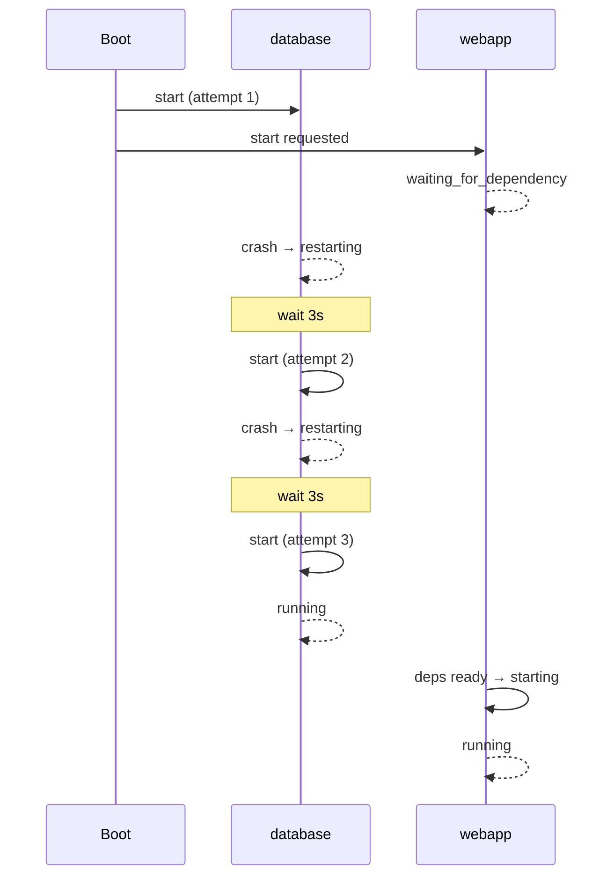

# Service lifecycle

This page shows **what happens over time** — not just a list of states, but a realistic boot story: one service keeps crashing and restarting, and another waits until the first one is finally healthy.

---

## States you will see

| State | In plain words |
|-------|----------------|
| `starting` | Start command is running |
| `running` | Daemon is up; microinit tracks a PID |
| `succeeded` | One-shot job finished OK |
| `failed` | Start failed or bad exit |
| `stopped` | Stopped on purpose |
| `disabled` | `enabled: false` |
| `waiting_for_dependency` | Should start, but `dependsOn` is not ready |
| `restarting` | Crashed; waiting `restartBackoff` before retry |
| `stopping` | Stop in progress |

Quick check:

```bash
microinit list
```

Columns **`restarts`** and **`live_fail`** help spot unstable services.

---

## Example: dependency + restart loop at boot

Scenario:

- **`database`** — a daemon that sometimes fails on cold boot (disk, port). It has `restart: true` and `restartBackoff: 3`.
- **`webapp`** — needs the database. It has `dependsOn: ["database"]`.

Short config:

```json
{
  "services": [
    {
      "name": "database",
      "daemon": true,
      "restart": true,
      "restartBackoff": 3,
      "startWaitSecs": 2,
      "startCmd": "/usr/sbin/mydatabase --foreground"
    },
    {
      "name": "webapp",
      "daemon": true,
      "restart": true,
      "restartBackoff": 2,
      "startWaitSecs": 1,
      "dependsOn": ["database"],
      "startCmd": "/usr/sbin/webapp"
    }
  ]
}
```

### Timeline (what the admin sees)

```text
Boot
  │
  ├─ database: starting
  │     └─ quick crash → failed, then restarting (restarts=1)
  │
  ├─ webapp: waiting_for_dependency (database not running yet)
  │
  ├─ … 3 seconds (restartBackoff) …
  │
  ├─ database: starting (2nd attempt)
  │     └─ crash again → restarting (restarts=2)
  │
  ├─ webapp: still waiting_for_dependency
  │
  ├─ … 3 seconds …
  │
  ├─ database: starting (3rd attempt)
  │     └─ stays up → running ✓
  │
  └─ webapp: dependency ready → starting → running ✓
```

After the **second restart** (third start attempt) the database finally runs — then **webapp starts on its own**, without `microinit start webapp`.

microinit retries `waiting_for_dependency` about every 200 ms in the background. No manual step needed.

### `microinit list` mid-boot

After the first database crash:

```text
database   failed       -    1   true   0
webapp     waiting_for_dependency  -  0   true   0
```

When the database is up:

```text
database   running      1234  2   true   0
webapp     running      1240  0   true   0
```

(`restarts=2` on database = two crashes before the successful run.)

---

## Diagram



---

## One-shot dependency

If **`network`** is one-shot (`daemon: false`) and exits 0 → state **`succeeded`**. That counts as “ready” for `dependsOn`.

If the one-shot **fails** (`failed`), dependents keep waiting until you fix and restart the dependency (or use `--force`).

---

## When waiting does **not** resume on its own

| You did | Result |
|---------|--------|
| Boot / `microinit start webapp` | Waits, then starts |
| `microinit stop webapp` while waiting | Stays **stopped** — fixing database does **not** start webapp |
| `microinit disable webapp` | **disabled** until `enable` |

---

## Crash after a successful start

If **`webapp`** is already **`running`** and **`database`** crashes:

- database goes through restarting / running (if `restart: true`);
- **webapp is not stopped automatically** — microinit does not cascade-stop dependents when a dependency dies.

If webapp must die with the database, that belongs in the app or a `livenessProbe` on webapp.

---

## Debugging

```bash
microinit list
microinit logs database --lines 80
microinit logs webapp --lines 80
# on a full system, also /dev/tty3
```

Force start (debugging only):

```bash
microinit start --force webapp
```

---

## Further reading

- [Configuration](configuration.md) — `dependsOn`, `restart`, hot reload  
- [Operator guide](operator.md)  
